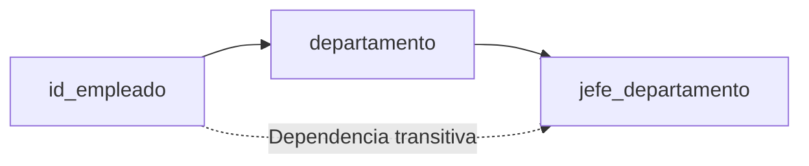

# Solución ejercicio valor opcional en objeto
## Solución 1
![[Drawing 2025-05-06 09.10.09.excalidraw]]
Ponerle valores por defecto no es la mejor opción; ya que no estamos controlando bien que **hasCar** esté en `false`. Porque igual quisieramos hacer algo diferente en el caso de que no haya un coche. Porque todo coche tiene un color.
## Solución 2
![[Drawing 2025-05-06 09.16.36.excalidraw|330]]
De esta forma le damos por defecto `null` para el caso de que nos ponga `false` en **hasColor**. Para que de esta manera no imprimamos nada. Esta es una buena práctica porque estamos contralando el comportamiento del programa.
## Solución 3
![[Drawing 2025-05-06 09.38.09.excalidraw]]
Trabajamos con un if para comprobar si coche o no. Y con un ternario para manejar el color.

# Formulario
El formulario no va a estar escrito directamente en HTML. Ese formulario va a estar dentro de un `
`. 
![[Drawing 2025-05-06 09.52.25.excalidraw|300]]

# Type
`type` : palabra reservada para definir un tipo. Para poner reglas a una variable.

Utiliza `,` en vez de `;` para separar las propiedades, pese a que sea posible. Al igual que estamos haciendolo con los objetos literales, y con os JSON.

# Múltiples tipos permitidos
![[Pasted image 20250506102734.png|220]]
Pese a que hemos definido un tipo `Person`. No nos va a dar ese tipo de dato. JavaScript nos va a devolver `object`

Es preferible emplear una función anónima para crear una función, en vez de función flecha. Esto es porque en otros lenguajes no existe esto. Así hacemos que más gente sepa leer este código con facilidad.

# Apuntador
Las variables siempre son punteros a una dirección de memoria.

# Normalizar
La clave es encontrar los datos repetidos.
La complejidad de una consulta realizada en 25 tablas va a ser bastante compleja. Pero eso no es un problema para la IA. De hecho, lo ideal es tener muchas tablas atómicas para ella.

En cualquier ID vamos a ahorrar espacio de memoria. Aunque a la vista estemos trabajando con más tablas. Lo cierto es que una cadena de caracteres van a ocupar más los números.

## 1FN (datos no repetidos)
Debemos quitar los grupos de datos repetidos.

## 2FN (dependencia funcional)
Que todas las columnas de una tabla dependan

En las tablas intermedias dices que no es buena práctica el colocarle una clave primaria para darle un índice a cada relación. Pero JC considera que sí está bien usar esa clave primaria; ya que en un futuro igual nos interesa usar esa relación para manejar alguna otra cosa.

## 3FN (dependencias transitivas)
Cuando una columna depende sólo indirectamente de la clave primaria. Porque realmente depende de otra columna, que sí depende directamente de la clave primaria.

También de esta manera evitamos redundancia.

# Lenguaje de Base de Datos SQL
SQL NO es un lenguaje totalmente universal. Sí que hay cierta diferencia en el manejo de datos entre distintos motores. Aunque solamente hay que hacerle pequeñas adaptaciones.

# Select
Va a ser nuestro Read en un CRUD típico.

## Concatenación
Generamos una consulta con una columna, con el nombre que le hemos asignado. Esta columna no existe en ninguna parte. Actúa como una vista, así que solo la podemos ver a través de esa consulta.
![[Drawing 2025-05-06 14.49.45.excalidraw|600]]

## Estructura de tabla
En el caso de queramos saber la estructura de una tabla en concreto. Saber qué campos tiene, y como son los tipos de datos de las columnas. Pero no te muestra los registros.
![[Pasted image 20250506145848.png|200]]

# IA
Maching Learning vs Deep Learning
LLM : sería ChatGPT o DeepSeek....

Para hacer una inteligencia artificial que trabaje con una empresa, debemos de hacer que esta acceda a todos los datos de esa empresa. Para que así se nutra de esa información y que así nos aconseje qué camino tomar en futuras decisiones. Si no le aportamos estos datos, no va a ser capaz de evaluar nada.

Los "expertos" nos van a vender la burra que emplear el modelo LLM en vez de usar una IA basada en esa base dedatos.
