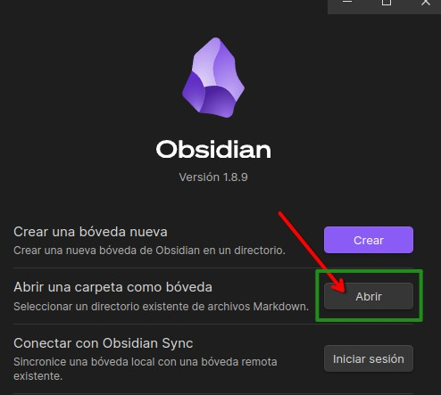

# Curso Forox Innovación 

Curso enfocado en asentar unas buenas bases para el control de versiones con Git y la programación en JavaScript. Impartido por Juan Carlos Varela Iglesias.

# Registro de actividades
## S.11

## S.12
### 17 Mar 2025
### 18 Mar 2025
### 19 Mar 2025
### 20 Mar 2025
### 21 Mar 2025
## S.13
### 24 Mar 2025
### 25 Mar 2025
### 26 Mar 2025
### 27 Mar 2025
### 28 Mar 2025
## S.14
### 31 Mar 2025
#### JavaScript
1. Iniciar repositorio
2. Crear rama **"develop"**
3. Crear rama **"seccion-02"**
4. *001_hola-mundo/*
	- Mostrar un "Hola mundo!" desde archivo .js 

### 1 Apr 2025
#### JavaScript
1. *002-variables/*
	- Declaración e inicialización de variables y constantes con valores
2. *003-console/*  
	1. Impresión individual de variable
	2. Impresión de diferentes objetos SEPARADOS por **"`,`"**
	3. Concatenación `+`
	4. Casting
	5. Mostrar las variables como un objeto
	6. `console.table([arreglo])`
	7. `console.table({objeto})`
	8. Separadores de texto para concatenaciones
3. *000-template/*
	- Plantilla para no tener que crear constantemente el "index.html" y "app.js"
4. *004-depuracion-breakpoints/*
	1. Breakpoint en Google Chrome
	2. Breakpoint en Visual Studio Code
5. *005-orden-y-lugar-de-importaciones/*
	- NO ES buena práctica declarar variables globales. El ámbito de una variable GLOBAL es el **objeto WINDOW**. Por lo tanto puedo alcanzar la variable desde cualquier lugar.
### 2 Apr 2025
#### JavaScript
1. *006-promp-confirm-alert/*
	- `.alert()`, `.prompt()` y `.confirm()`: **métodos** del objeto window
2. Crear la rama **"seccion-01"**.
3. Cargar perfil de configuración y extensiones **"WebDev"**.
4. Traer cambios de la rama "seccion-02" a la "develop"
5. Crear la rama **"seccion-03"**.
6. Añadir  *000-template/* a rama **"seccion-03"**.
### 3 Apr 2025
#### JavaScript
- *007-tipos-datos-primitivos/*
	- app_boolean.js
		- Booleanos: true, false y casting a number.
		- Números: positivo, negativo, cero y casting a boolean.
		- String: con longitud, sin longitud y casting a boolean.
		- Array: con longitud, vacío y casting a boolean.
		- Objeto: con propiedades, vacío, **arreglo de sus claves** y casting a boolean.
		- Null: tipo de dato y casting a boolean.
		- Undefined: tipo de dato y casting a boolean. **No usar nunca**
	- app_null.js : Cómo se comporta un `null` tras un casting y comparación.
	- app_numbers.js : 0, -0, positivos, negativos, binarios, octal y hexadecimal.
	- app_strings.js : Uso de comillas, anidación de comillas e interpolación de variables.
### 4 Apr 2025
#### JavaScript
- *008-nombres-variables-y-palabras-reservadas/*
	- Palabras reservadas del lenguaje.
	- Reglas para nombres de variables.
- *info-guia-de-estilo.txt*
- *info-palabras-reservadas.txt*
## S.15
### 7 Apr 2025
#### JavaScript
1. *009-arreglos/*
	1. Declaración de arrays.
	2. Casting a array de distintos tipos de datos.
	3. Matrices de 2 o más dimensiones.
2. *010-arreglos-2/*
	1. Longitud del array.
	2. 1° y último elemento.
	3. Recorrer el array con **forEach()**.
	4. **Acumulador** con forEach().
	5. Método **push()**
	6. Método **unshift()**
	7. Método **pop()**
	8. Método **shift()**
	9. Recorrer array desde el principio, con un for().
	10. Recorrer con un for() desde el final y generar otro array con los valores del original.
	11. Método **splice()** : eliminar uno o varios elementos a partir de un índice determinado
	12. Metodo **indexOf()** : obtener el índice de un elemento.
	13. Método **slice()** : extraer elementos de un array a otro array.
	14. Convertir un string en array para utilizar índices negativos. **for()** + **slice()**
### 8 Apr 2025
#### JavaScript
1. *011-array-determinante-matriz/*
	- Calcular el determinante de una m de 3x3, como posible ejercicio matemático, para trabajar con las posiciones de una matriz.
2. *012-objetos-literales/*
	1. Estructura básica
	2. Ejemplo de uso con un árbol genealógico.
	3. Notación de punto, de corchetes y mixta.
	4. Crear dinámicamente una propiedad en el objeto.
	5. **delete** : eliminar una propiedad existente. 
	6. **Object.entries()** : Transformar un objeto en arreglos `Clave: Valor`
	7. Comportamiento de un objeto al definirlo con `const`.
	8. **Object.freeze()** : "Congela" las propiedades de ==primer nivel==.
	9. Introspección de objetos
		1. **Object.getOwnPropertyNames()** : array con los nombres de todas las propiedades propias del objeto, ==aunque no sean enumerables==.
		2. **Object.getOwnPropertyDescriptors()** : objeto con los atributos internos de ==una propiedad específica== de un objeto.
		3. **Object.getOwnPropertyDescriptor()** : objeto que contiene los descriptores de ==TODAS las propiedades== del objeto.
		4. **Object.values()** : array con los valores de las propiedades ==enumerables==.

### 9 Apr 2025
#### JavaScript
1. *013-ejercicio-arrays/*
	- Notación mixta
2. *014-funciones-basicas-y-de-flecha/*
	1. Definición de función
	2. Procedimiento implícito vs procedimiento explícito
	3. Funciones como ciudadanos de 1ª Clase / Categoría
	4. Closures (Clausuras)
	5. Funciones fábrica (Factory Functions)
	6. Currying
	7. Funciones almacenadas en estructuras de datos
	8. Funciones anónimas
	9. Argumentos en funciones TRADICIONALES
	10. Funciones flecha
	11. Funciones flecha con autoejecución.
### 10 Apr 2025
#### JavaScript
1. *015-retorno-de-funciones/*
	1. Procedimiento : función que no retorna "nada"
	2. Comportamiento del `return`
	3. Función almacenada en variable.
		1. Tradicional
		2. Anónima
		3. Flecha
		4. Flecha autoinvocada
	4. **Math.random()** : número aleatorio entre 0 y 1.
2. *016-funcion-como-argumento/*
	- Comparativa entre una función que se le pasa otras 2 como argumentos. Y su equivalente en función "tradicional".
3. *017-tips-desestructuracion-retornos/*
### 11 Apr 2025
#### JavaScript
1. *017-tips-desestructuracion-retornos/*
2. *018-valor-referencia/*
## S.16

### 14 Apr 2025
#### JavaScript
1. *019-if-else/*
### 15 Apr 2025
#### JavaScript
1. *020-switch*
2. *021-logica-booleana*
3. *999-.../004-tablas-de-la-verdad.pdf*
4. *999-.../005-xor-en-javascript.pdf*
5. *022-operador-ternario/*
### 16 Apr 2025
#### JavaScript
1. *022-operador-ternario/*
2. *023-operador-ternario-ejercicio-fase1/*
3. *023-operador-ternario-ejercicio-fase2/*
## S.17
### 21 Apr 2025
#### JavaScript
1. *023-operador-ternario-ejercicio-fase2/*
2. *024-while-do-while/*
### 22 Apr 2025
#### JavaScript
1. *025-for-for-in-for-of-foreach/*
2. *026-desestructuracion-arreglos/*
3. *027-desestructuracion-objetos/*
### 23 Apr 2025
#### TypeScript
1. *000-template/*
2. *001-hola-mundo/*
3. *002-tsconfig-y-watch-mode/*
4. *003-inferir-tipos-y-modo-estricto/*
5. *004-booleanos/*
### 24 Apr 2025
#### TypeScript

### 25 Apr 2025
#### TypeScript
## S.18
### 28 Apr 2025
#### TypeScript
### 29Apr 2025
#### TypeScript
### 30 Apr 2025
#### TypeScript
## S.19
# Tutorial

## 0. Clonar repositorio

## 1. Descargar Obsidian

https://obsidian.md/download

## 2. Abrir el repositorio

### 3. Aceptar plugins y configuración del autor